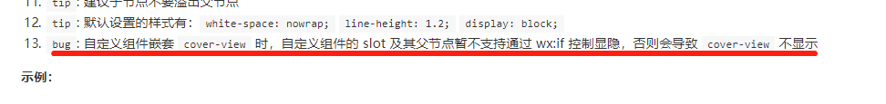

# mp-navigation-bar

微信小程序自定义导航组件

仿照小程序官方提供的自定义导航组件，添加了回到首页功能。

> 使用此组件需要依赖小程序基础库 2.2.1 以上版本，同时依赖开发者工具的 npm 构建。具体详情可查阅[官方 npm 文档](https://developers.weixin.qq.com/miniprogram/dev/devtools/npm.html)。

## BUGs

- [x] 页面内有原生组件，且能滚动到顶部时，会覆盖导航栏
    使用 `cover-view` 组件替代原本的 `view` 组件来达到覆盖原生组件的目的

- [ ] `input` 组件在较低位置(距离底部高度低于键盘高度)获取焦点时，弹出键盘会将导航栏顶起

- [ ] 由于使用了 `cover-view` 做导航栏，所以自定义 `action` 的 slot 也需要使用 `cover-view` 组件。
    但是根据官方文档的提示：可能会无法显示。故暂不建议使用自定义 `action` 插槽。
    `v0.0.4`
    

## TIPs

1. 回到首页，首页的默认值为 `/pages/home/home`，可以通过设置 `app.__APP_HOME_PATH__` 来修改回到首页的页面路径。

2. 由于使用的 `cover-view` 组件，且用到了 `transform: scale(0.5)`。根据官方文档[tip](https://developers.weixin.qq.com/miniprogram/dev/component/cover-view.html#bug--tips)，需要依赖基础库 `2.1.0`

3. 原生组件与原生组件之间的层级遵循后来居上的规则，如果有动态展示的原生组件，层级依然会高于导航栏，此时可以通过调用组件的 `refreshNavigation` 方法来刷新 `navigation-bar` 的重新渲染，达到不被覆盖的目的。

4. `auto-stick` 属性如果是动态设置的，状态改变时，会触发页面内容重新渲染，从而可能引起预料外的问题。

    如在安卓端，视频全屏播放时，设置 `hide-nav="true" auto-stick="true"` 会导致视频退出全屏并暂停。

    此种情况，请只设置 `hide-nav="true"` 来隐藏导航，在视频退出全屏时再设置显示导航。

## 使用演示


## 使用方法

1. 安装 mp-navigation-bar

``` bash
$ npm install --save mp-navigation-bar
```

2. 在 `app.json` 中设置：

``` json
{
  "window": {
    "navigationStyle": "custom"
  }
}
```

3. 在需要使用 `mp-navigation-bar` 的页面 page.json 中，添加配置：

``` json
{
  "usingComponents": {
    "navigation-bar": "mp-navigation-bar"
  }
}
```

4. 在 `wxml` 文件中使用 `<navigation-bar>`

``` xml
<navigation-bar title="{{title}}" bindback="handleBack" bindhome="handleHome">
  <view class="page-content">Page content here.</view>
</navigation-bar>
```

### 属性介绍

| 属性名称      | 类型    | 默认值  | 是否必须 | 说明                                          |
|--------------|---------|--------|----------|----------------------------------------------|
| title        | String  | WeChat | 否       | 导航栏标题                                    |
| enable       | Boolean | true   | 否       | 是否允许点击返回按钮返回                        |
| delta        | Number  | 1      | 否       | 返回的页面数                                   |
| show-home    | Boolean | true   | 否       | 是否显示首页按钮                               |
| hide-back    | Boolean | false  | 否       | 是否隐藏返回按钮                               |
| bg-color     | String  | white  | 否       | 导航栏背景色                                   |
| text-style   | String  | dark   | 否       | 导航栏标题文字颜色 (dark/light)                 |
| auto-capsule | Boolean | true   | 否       | 是否根据 `text-style` 自动更改小程序默认胶囊颜色 |
| auto-height  | Boolean | true   | 否       | 是否由内容自动撑开高度, 为 `false` 时，会设置 `height: 100%`，请注意给父组件设置高度 (0.0.6)|
| hide-nav     | Boolean | false  | 否       | 是否隐藏自定义导航 (0.0.9) |
| auto-stick   | Boolean | false  | 否       | 隐藏自定义导航时，是否将内容自动上推到顶 (0.0.9) |
| opacity      | Number  | 1      | 否       | 自定义导航的不透明度 (0.0.10)                  |

### 事件介绍

| 事件名称  | 参数   | 说明              |
|----------|--------|------------------|
| bindback | Object | 点击返回按钮的事件 |
| bindhome | Object | 点击主页按钮的事件 |

### slot

组件有两个 `slot`

1. 默认 `slot` 为方便使用者装载页面内容使用。
由于导航为 `fixed` 定位，故不占用文档流位置，使用时需要在页面顶部留足相应的边距。
该插槽已经留出这部分边距，避免用户每个页面都手动设置一次。

2. 第二个为用户自定义左上角位置的slot，`name=action`
该部分通过 `absolute` 定位在左侧。
使用时，建议设置 `show-home=false hide-back=true` 来隐藏默认 `action` 胶囊。
