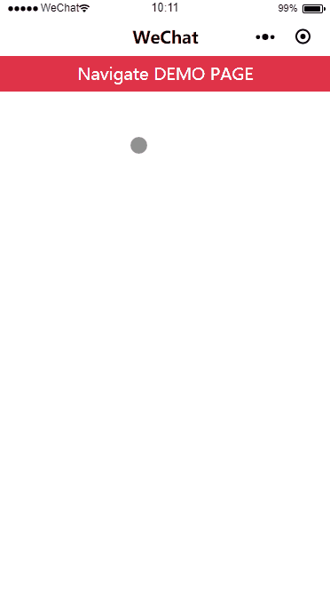

# mp-navigation-bar

微信小程序自定义导航组件

仿照小程序官方提供的自定义导航组件，添加了回到首页功能。

> 使用此组件需要依赖小程序基础库 2.2.1 以上版本，同时依赖开发者工具的 npm 构建。具体详情可查阅[官方 npm 文档](https://developers.weixin.qq.com/miniprogram/dev/devtools/npm.html)。

## 使用演示



## 使用方法

1. 安装 mp-navigation-bar

``` bash
$ npm install --save mp-navigation-bar
```

2. 在 `app.json` 中设置：

``` json
{
  "window": {
    "navigationStyle": "custom"
  }
}
```

3. 在需要使用 `mp-navigation-bar` 的页面 page.json 中，添加配置：

``` json
{
  "usingComponents": {
    "navigation-bar": "mp-navigation-bar"
  }
}
```

4. 在 `wxml` 文件中使用 `<navigation-bar>`

``` xml
<navigation-bar title="{{title}}" bindback="handleBack" bindhome="handleHome">
  <view class="page-content">Page content here.</view>
</navigation-bar>
```

### 属性介绍

| 属性名称 | 类型 | 默认值 | 是否必须 | 说明 |
|---------|------|-------|----------|------|
| title | String | WeChat | 否 | 导航栏标题 |
| enable | Boolean | true | 否 | 是否允许点击返回按钮返回 |
| delta | Number | 1 | 否 | 返回的页面数 |
| show-home | Boolean | true | 否 | 是否显示首页按钮 |
| hide-back | Boolean | false | 否 | 是否隐藏返回按钮 |
| bg-color | String | white | 否 | 导航栏背景色 |
| text-style | String | dark | 否 | 导航栏标题文字颜色 (dark/light) |

### 事件介绍

| 事件名称  | 参数   | 说明              |
|----------|--------|------------------|
| bindback | Object | 点击返回按钮的事件 |
| bindhome | Object | 点击主页按钮的事件 |

### slot

组件有两个 `slot`

1. 默认 `slot` 为方便使用者装载页面内容使用。
由于导航为 `fixed` 定位，故不占用文档流位置，使用时需要在页面顶部留足相应的边距。
该插槽已经留出这部分边距，避免用户每个页面都手动设置一次。

2. 第二个为用户自定义左上角位置的slot，`name=action`
该部分通过 `absolute` 定位在左侧。
建议使用时，设置 `show-home=false`,`hide-back=true`来隐藏默认 `action` 胶囊。
